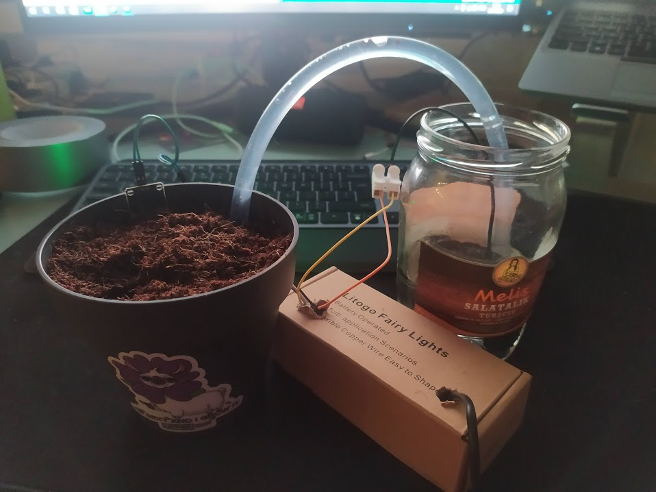
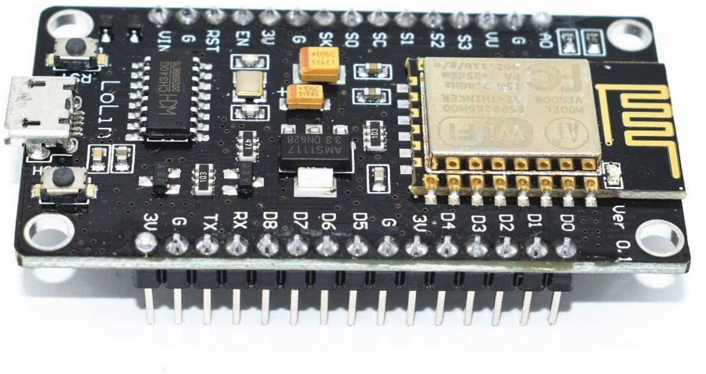
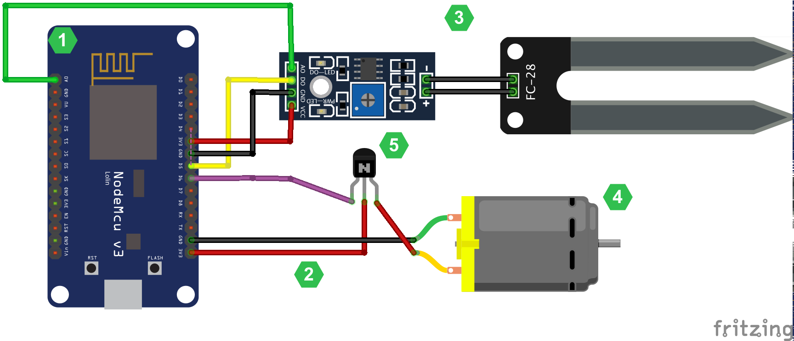

# Self-watering-plant
Created at self watering plant on the project event hosted by OfferZen. Hopefully my basils will grow happily :)

# End result

## What is used
- ESP8266 as microchip with wifi
- Moisture sensor for measuring soil moisture
- Watering pump for water
- MQTT for communication

## What is achieved
- Simple web server working on the microchip
- Self watering logic
- MQTT pub-sub communication to capture live data and send commands to the microchip

# Components
## ESP8266 microprocessor
ESP8266 microprocessor is chosed by OfferZen for being small, effective and being able to use wifi directly.

## Moisture Sensor 
Moisture sensor comes with it's own processor to manage the treshold manually, when you connect it to a microprocessor you get analog reading as 0-1024 for humidity, and digital 0-1 for "is treshold exceeded" value.

## Water pump
It's a simple waterpump

## Big picture
The components connects in regular sense to connect grounds, provide power and connect data pins

# Code discussion
Actually, the code is pretty simple but it has parts for managing different stuff as creating a web server, connecting to the local wifi, managing mqtt connection, managing sensors. And since they are all on one file I will explain one by one.

## Connecting to local wifi 
Connecting the local wifi requires knowing wifi name (and obviously password) before connection. In the ESP8266Wifi library, `Wifi.begin()` method handles the connection so we need to call it inside setup

    #include <ESP8266WiFi.h>
    
    #define NETWORK_NAME "network name" 
    #define PASSWORD "network password"
    
    void setup() {
      Serial.begin(115200); //set baud rate
      Serial.print("Connecting to ");
      Serial.println(NETWORK_NAME);
      
      WiFi.begin(NETWORK_NAME, PASSWORD); //connect
      while (WiFi.status() != WL_CONNECTED) { //wait for approval
        delay(500);
        Serial.print(".");
      }
      Serial.println("");
      Serial.print("WiFi connected - ESP IP address: ");
      Serial.println(WiFi.localIP());
    }

## Creating a web server
Creating a web server is all handled by ESP8266WebServer library. We just need to define the port and configure what happens on route calls.
    
    #include <ESP8266WebServer.h>

    #define PORT 80

    ESP8266WebServer server(PORT); // define server with port
    
    void setup() {
      Serial.begin(115200); //set baud rate
      server.on("/", handleRoot); //set route handling               
      server.begin();                           
      Serial.println("HTTP server started");
    }

    void handleRoot() {
      server.send(200, "text/plain", "Hello World!");
    }
    
## Managing MQTT connection
Managing MQTT connection is all handled by PubSubClient library. But we need to configure server address, client, topics we want to listen and manage possible reconnections. For this example I send messages to the plant-data topic for listeners and to be able to manage pump from outside, I subscribed plant-pump topic.

    #include <PubSubClient.h>
    
    #define MQTT_SERVER "broker.mqttdashboard.com" //used publicly available hivemq dashboard http://www.hivemq.com/demos/websocket-client/
    #define MQTT_CLIENT_ID "your client id"
    
    WiFiClient espClient;
    PubSubClient client(espClient); //set connection client
    
    char buffer [50]; //extend if bigger data is expected
    void setup() {
      Serial.begin(115200); //set baud rate
      client.setServer(MQTT_SERVER, 1883);
      client.setCallback(callback);
    }
    
    void loop() { //ensure connection on each loop
      if (!client.connected()) {
        reconnect();
      }
      if(!client.loop())
        client.connect(MQTT_CLIENT_ID);
    }
    
    // This functions is executed when some device publishes a message to a topic that your ESP8266 is subscribed to
    // Change the function below to add logic to your program, so when a device publishes a message to a topic that 
    // your ESP8266 is subscribed you can actually do something
    void callback(String topic, byte* message, unsigned int length) {
      Serial.print("Message arrived on topic: ");
      Serial.print(topic);
      Serial.print(". Message: ");
      String messageTemp;
      
      for (int i = 0; i < length; i++) {
        Serial.print((char)message[i]);
        messageTemp += (char)message[i];
      }
      Serial.println();
    
      // Feel free to add more if statements to control more GPIOs with MQTT
    
      if(topic == "plant-pump"){ //selected plant-pump topic for my example, when message "1" is sent, pump starts working
        if(messageTemp == "1"){
          //start pump
        }else{
          //stop pump
        }
      }
    }
    
    // This functions reconnects your ESP8266 to your MQTT broker
    // Change the function below if you want to subscribe to more topics with your ESP8266 
    void reconnect() {
      // Loop until we're reconnected
      while (!client.connected()) {
        Serial.print("Attempting MQTT connection...");
        // Attempt to connect
        if (client.connect(MQTT_CLIENT_ID)) {
          Serial.println("connected");  
          // Subscribe or resubscribe to a topic
          // You can subscribe to more topics (to control more LEDs in this example)
          client.subscribe("plant-pump"); //listening plant-pump topicsazx
        } else {
          Serial.print("failed, rc=");
          Serial.print(client.state());
          Serial.println(" try again in 5 seconds");
          // Wait 5 seconds before retrying
          delay(5000);
        }
      }
    }
    
## Managing sensors
Managing sensors is also simple in it's own scope. We need to define pins we used for analog and digital (A0 and D5 for this case) and read/write them on each loop. There is also a measure period included as 10 seconds to prevent instant start/stops.

    #define LED D4 // Use built-in LED which connected to D4 pin or GPIO 2
    #define MEASURE_PERIOD 10000 //measure period to prevent instant start/stops 
    #define ANA A0 //analog input
    #define DIGI D5 //digital input
    #define POMPOUT D6 //pump output
    
    long now = millis();
    long lastMeasure = 0;
    
    double analogValue = 0.0;
    int digitalValue = 0;
    
    void setup() {
      pinMode(ANA, INPUT);
      pinMode(DIGI, INPUT);
      pinMode(POMPOUT, OUTPUT);
      
      Serial.begin(115200);
    }
    
    void loop() {
      now = millis();
      // Publishes new temperature and humidity every 30 seconds
      if (now - lastMeasure > MEASURE_PERIOD) {
        lastMeasure = now;
        analogValue = analogRead(ANA);
        digitalValue = digitalRead(DIGI);
        
        Serial.print("Analog raw: ");
        Serial.println(analogValue);
        Serial.print("Digital raw: ");
        Serial.println(digitalValue);
        Serial.println(" ");
        
        if (digitalValue == 0) {
          digitalWrite(POMPOUT, false); //stop pumping water
        } else {
          Serial.println("PUMPIN");
          digitalWrite(POMPOUT, true); //start/continue pumping water
        }
      }
      //here we should send our mqtt messages for listeners
    }
